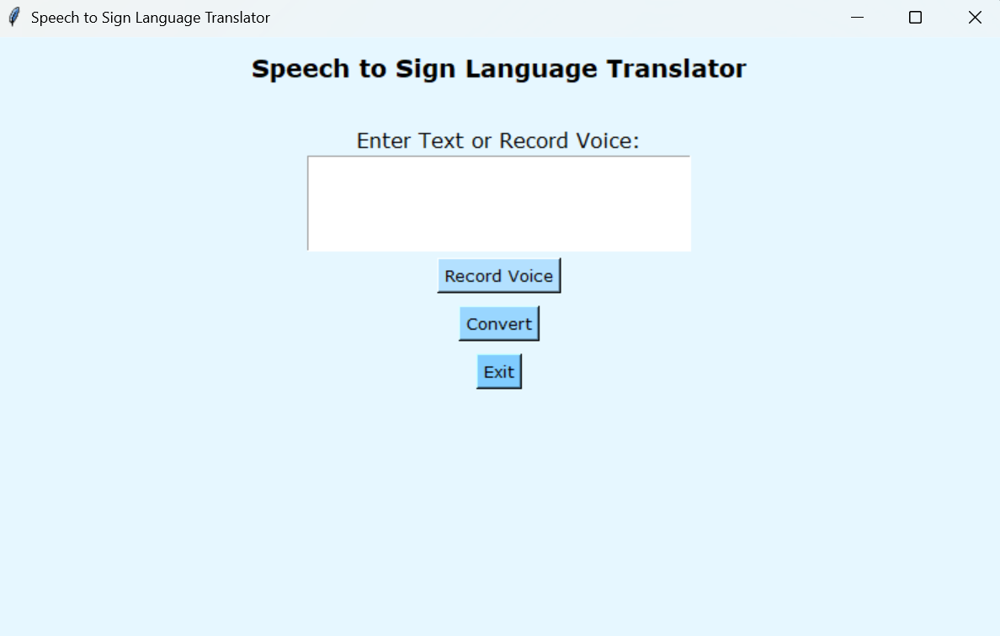
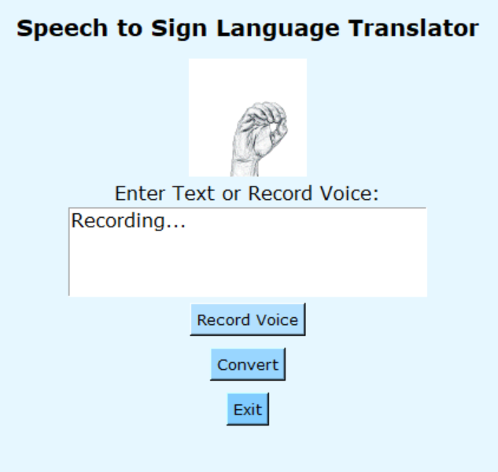
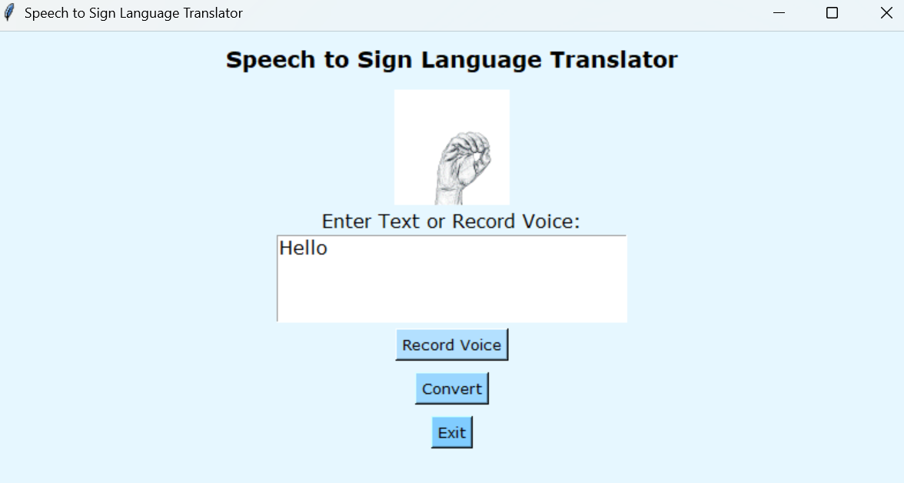

# Speech to Sign Language Translator

A powerful Python application that converts speech and text into sign language animations in real-time. This tool helps bridge the communication gap between hearing and non-hearing individuals by providing an intuitive interface for sign language translation.

## 🌟 Features

- **Speech Recognition**: Convert spoken words to text using Google's Speech Recognition API
- **Text Input**: Type text directly for sign language translation
- **Real-time Animation**: View sign language animations for words and individual letters
- **User-friendly Interface**: Clean and intuitive GUI built with tkinter
- **Comprehensive Dictionary**: Supports common words and phrases
- **Letter-by-Letter Translation**: Fallback to individual letter animations for unknown words

## 📸 Screenshots

<!-- Add your screenshots here -->




## 🚀 Getting Started

### Prerequisites

- Python 3.7 or higher
- Working microphone (for speech recognition)
- Internet connection (for speech recognition API)

### Installation

1. Clone the repository:
```bash
git clone https://github.com/yourusername/speech-to-sign-language.git
cd speech-to-sign-language
```

2. Install required dependencies:
```bash
pip install numpy opencv-python pillow SpeechRecognition tensorflow keras
```

3. Run the application:
```bash
python main.py
```

## 💻 Usage

1. **Text Input**:
   - Type your text in the input box
   - Click "Convert" to see the sign language animation

2. **Voice Input**:
   - Click "Record Voice"
   - Speak clearly into your microphone
   - The text will appear in the input box
   - Click "Convert" to see the sign language animation

3. **Viewing Animations**:
   - Animations will play automatically
   - Each word or letter will be shown in sequence
   - Animations loop until completion

## 📁 Project Structure

```
speech-to-sign-language/
├── main.py              # Main application file
├── model.h5            # Trained model for sign language recognition
├── train.py            # Training script for the model
├── read.py             # Utility functions for reading data
├── extract.py          # Data extraction utilities
├── fitered_data/       # Directory containing word animations
├── alphabet/           # Directory containing letter animations
└── screenshots/        # Directory for documentation screenshots
```

## 🛠️ Technical Details

- **GUI Framework**: tkinter
- **Speech Recognition**: Google Speech Recognition API
- **Image Processing**: OpenCV and PIL
- **Machine Learning**: TensorFlow/Keras
- **Animation Format**: GIF and WebP

## 📝 Supported Words and Phrases

The application supports a wide range of words and phrases, including:
- Common words (hello, thank you, please)
- Weather-related terms (sunny, rainy, cloudy)
- Time expressions (morning, evening, night)
- Days of the week
- Months of the year
- And many more!

## 🤝 Contributing

Contributions are welcome! Please feel free to submit a Pull Request.

1. Fork the repository
2. Create your feature branch (`git checkout -b feature/AmazingFeature`)
3. Commit your changes (`git commit -m 'Add some AmazingFeature'`)
4. Push to the branch (`git push origin feature/AmazingFeature`)
5. Open a Pull Request

## 📄 License

This project is licensed under the MIT License - see the [LICENSE](LICENSE) file for details.

## 🙏 Acknowledgments

- Google Speech Recognition API
- TensorFlow and Keras communities
- All contributors and users of this project

## 📞 Contact

Your Name - [@yourtwitter](https://twitter.com/yourtwitter) - email@example.com

Project Link: [https://github.com/yourusername/speech-to-sign-language](https://github.com/yourusername/speech-to-sign-language)

---

⭐️ If you like this project, please give it a star on GitHub! 